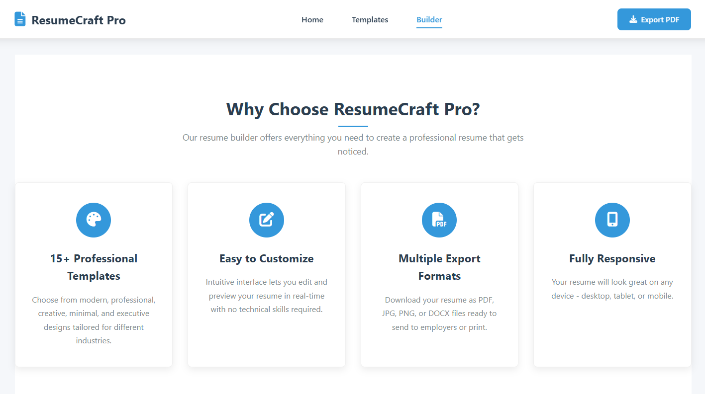
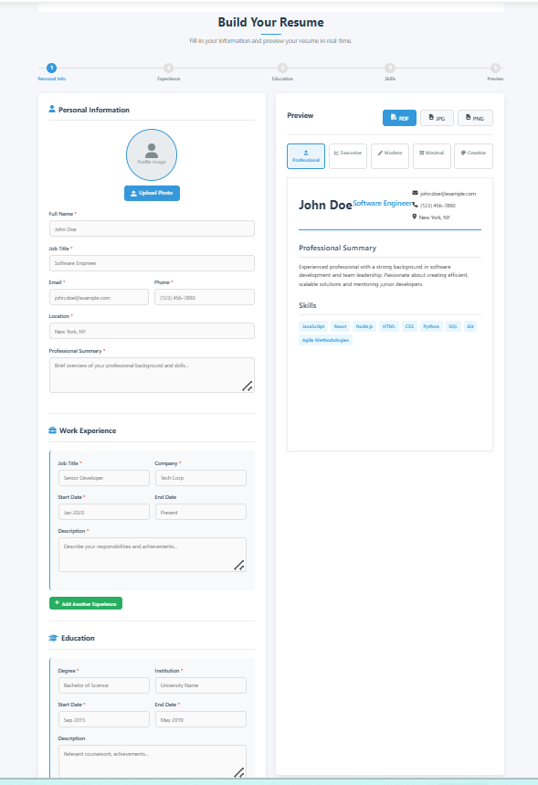

# 📄 Resume Builder

A simple and interactive **Resume Builder** created using **HTML, CSS, and JavaScript** in a **single file (`index.html`)**.  
This project allows users to create, customize, and download professional resumes with ease.

---

## 🚀 Features
- All code (HTML, CSS, JavaScript) in **one file: `index.html`**  
- User-friendly interface  
- Multiple resume templates  
- Live preview while editing  
- Option to upload profile picture  
- Download resume as PDF  

---

## 🖼️ Screenshots  

  
  

---

## 🛠️ Technologies Used
- **HTML5** – Structure of the resume builder  
- **CSS3** – Styling and template design  
- **JavaScript** – Interactivity and live preview  

---

